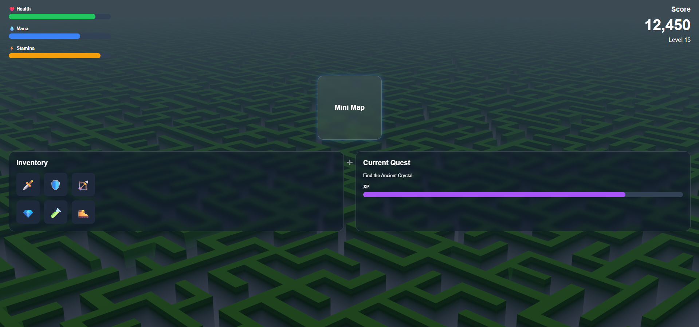

# Nebula Core - Game HUD

A modern game-inspired Heads-Up Display (HUD) built with HTML, CSS, and JavaScript. This project demonstrates reusable game UI components commonly found in RPG and action games.

## 🖼️ Preview



## ✨ Features

- Health, Mana, and Stamina Bars
- Mini Map
- Inventory Panel
- Current Quest Tracker
- XP Progress Bar
- Score & Level Display
- Glassmorphism UI Design
- Responsive Layout
- Smooth Hover Effects
- Modern Game Interface

## 🛠️ Technologies Used

- HTML5
- CSS3
- JavaScript

## 📂 Project Structure

```text
game-hud/
│── index.html
│── style.css
│── script.js
│── README.md
└── assets/
    │── background.jpg
    └── screenshot.png
```

## 🎯 Purpos

This project showcases a responsive and reusable Game HUD interface inspired by modern RPG and action games. It demonstrates UI layout techniques using Flexbox and Grid, along with interactive components and clean frontend architecture.

## 👩‍💻 Author

Greeshma Balachandran